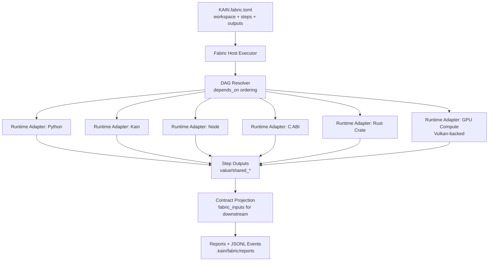
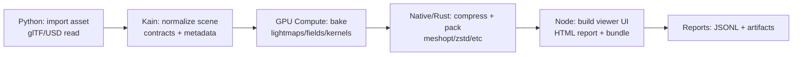

# Kain Fabric Pipeline in godkain: Deep Research Report

## Executive summary

The newly implemented **Kain Fabric pipeline** in `ephemara/godkain` is a **local-first, manifest-driven orchestration layer** that lets you build complete applications and end-to-end 3D/compute pipelines by composing **multi-runtime “steps”** (Kain, Python, Node, C ABI native libraries, Rust crates, and GPU compute) with explicit data contracts (plain values, shared buffers, shared images). A Fabric run is described by a `KAIN.fabric.toml` manifest that declares a workspace root, step dependencies, and step outputs; the Fabric host resolves a DAG of steps and wires each step’s outputs into downstream `fabric_inputs`. fileciteturn19file0L1-L1

In the repo, the best “how it works in practice” references are the two smoke tests:

- **Polyglot local-first**: Python produces scalar settings → Kain builds a shared RGBA image → a C ABI plugin mutates the shared image and emits a shared buffer snapshot → a Rust crate computes a checksum → Node renders HTML. This demonstrates Fabric’s **multi-language composition** plus **zero-copy-ish contracts** for image/buffer plumbing. fileciteturn19file0L1-L1  
- **GPU compute convergence**: Python settings → Kain creates `src`/`dst` shared buffers → `gpu_compute` runs a Vulkan-backed compute task (“FabricGpuCopy”) → Node reads the resulting shared buffer as typed bytes. fileciteturn27file0L1-L1 fileciteturn28file0L1-L1

From an application developer’s standpoint, Fabric’s key unlock is that you can treat *Kain* as the **orchestration/control plane** (glue logic + contract assembly) and push domain-heavy work into the best runtime for the job: Python for data science/asset conditioning, native/Rust/C for performance-critical transforms, Node for HTML/UI packaging and tool UX, and GPU compute for parallel kernels. fileciteturn21file0L1-L1 fileciteturn22file0L1-L1 fileciteturn32file0L1-L1

Assumptions (explicit): this report assumes you build and run Fabric via the **Rust `cargo` toolchain** (because the canonical invocation in-repo uses `cargo run -p cli --bin kain -- ...`). fileciteturn27file0L1-L1 It also assumes your target is **local developer machines** (the manifests shown require `session.local`). fileciteturn19file0L1-L1 If you intend remote/distributed execution, treat those parts below as integration patterns rather than “already shipped” behavior.

## Fabric architecture and mental model

At a high level, Fabric is: **Manifest → DAG of steps → runtime adapters → contract projection → reports**.

### Core components and responsibilities

Fabric in `godkain` is structured around these conceptual components (names reflect code/modules and usage shown in-repo):

- **Fabric manifest (`KAIN.fabric.toml`)**: Declares `version`, `workspace` root + `search_roots`, required capabilities (e.g., `session.local`), and a list of `steps`, each with `id`, `runtime`, `entry` (or runtime-specific fields), `depends_on`, and declared `outputs` (e.g., `value`, `shared_buffer`, `shared_image`). fileciteturn19file0L1-L1  
- **CLI entrypoint (`kain fabric …`)**: Fabric is exposed through `validate` and `run` commands (and typically also `init`). This is how developers interact with Fabric day-to-day. fileciteturn12file0L1-L1  
- **Host executor**: The host resolves dependency order, runs steps, and materializes the outputs in a canonical form for downstream steps. (In-repo this logic is implemented in the host layer referenced by the CLI.) fileciteturn12file0L1-L1 fileciteturn17file0L1-L1  
- **Runtime adapters**:  
  - **Python** steps expose a `run(fabric_inputs)` entry pattern (smoke test). fileciteturn20file0L1-L1  
  - **Node** steps expose `export function run(fabricInputs) { ... }` (smoke test). fileciteturn21file0L1-L1  
  - **Kain** steps read from `fabric_inputs.<step_id>.<output>` and return a struct matching declared outputs. fileciteturn22file0L1-L1  
  - **C ABI** steps call into a native dynamic library (DLL in the smoke test) via a `use c::<module>` binding. fileciteturn19file0L1-L1 fileciteturn23file0L1-L1  
  - **Rust crate** steps bind to a local crate and call Rust functions from Kain via `use rust::<crate_name>`. fileciteturn19file0L1-L1 fileciteturn24file0L1-L1  
  - **GPU compute** steps point at a Kain shader source and a `compute_key`, and the smoke test states it runs “through the Vulkan executor.” fileciteturn27file0L1-L1 fileciteturn28file0L1-L1  
- **Interop contracts**: Kain code constructs and inspects portable data objects like **shared images** and **shared buffers** using `std::interop::bridge` helpers such as `interop_shared_image_from_bytes`, `interop_shared_image_info`, `interop_shared_image_bytes`, and `interop_shared_buffer_from_bytes`. fileciteturn22file0L1-L1 fileciteturn23file0L1-L1  
- **Reports and event logging**: Manifests can set a reports directory and emit JSONL events, which is intended to support debugging, traceability, and tooling. fileciteturn19file0L1-L1

### Architecture diagram



### How data moves: contracts and `fabric_inputs`

Fabric’s “wiring harness” is visible directly in the smoke tests:

- A Python step returns a dictionary of scalars (settings), declared as an output `kind = "value"`, and downstream steps read it as `fabric_inputs.python_source.settings`. fileciteturn19file0L1-L1 fileciteturn22file0L1-L1  
- A Kain step constructs a shared image from an RGBA byte array and returns it as `image`; downstream steps treat it as a shared-image handle and can inspect or mutate it. fileciteturn22file0L1-L1 fileciteturn23file0L1-L1  
- A Node step reads structured contracts produced upstream (including metadata like `width`, `height`, `channels` and `byte_length`) and uses them to generate a UI string. fileciteturn21file0L1-L1  
- The GPU compute smoke shows shared buffers as the cross-runtime “currency”: Kain creates `src`/`dst`, GPU compute overwrites `dst`, and Node reads the bytes as a typed array view. fileciteturn31file0L1-L1 fileciteturn30file0L1-L1

## Newly implemented feature set and implications

This section enumerates the “new features” as evidenced by the in-repo manifests, smoke tests, and runtime adapter code.

### Capability highlights

Fabric’s newly implemented pipeline capabilities include:

- **Versioned manifest format (`version = 1`)**: Enables forward evolution of the manifest schema without breaking older pipelines. fileciteturn19file0L1-L1  
- **Workspace scoping via `root` + `search_roots`**: Establishes a standard layout for resolving steps and assets across `src/`, `scripts/`, `shaders/`, etc. This is crucial for 3D pipelines where shader sources, native plugins, and scripts live side by side. fileciteturn19file0L1-L1 fileciteturn28file0L1-L1  
- **DAG execution (`depends_on`)**: Explicit dependencies provide reproducibility and allow potential parallelization in future (where safe). fileciteturn19file0L1-L1  
- **Multi-runtime steps**: The manifest accepts `runtime = "python" | "kain" | "c_abi" | "rust_crate" | "node" | "gpu_compute"` (as used in the smoke tests), making Fabric a polyglot pipeline runner rather than a single-language build tool. fileciteturn19file0L1-L1 fileciteturn28file0L1-L1  
- **Declared output contracts (`value`, `shared_buffer`, `shared_image`)**: Output typing is a contract between steps and the host, enabling validation and canonical projection into downstream runtimes. fileciteturn19file0L1-L1  
- **GPU compute step with Vulkan execution**: The GPU convergence smoke explicitly describes GPU compute running via a Vulkan executor and shows a Kain shader with a `comptime` compute plan and storage buffer bindings. fileciteturn27file0L1-L1 fileciteturn32file0L1-L1  
- **Reporting hooks (`emit_jsonl_events`)**: Manifests can request JSONL event emission, which is a strong signal Fabric is designed for pipeline observability and tooling integration. fileciteturn19file0L1-L1

### Feature-to-implication mapping

| Feature | How you use it | Practical implication for apps and 3D pipelines |
|---|---|---|
| Step DAG + `depends_on` | Declare upstream IDs | Deterministic build/render/asset flows; easier incrementalization later (even if not fully implemented yet). fileciteturn19file0L1-L1 |
| `shared_buffer` contract | Kain builds with `interop_shared_buffer_from_bytes(...)` | Efficient interchange for geometry, tensors, baked assets, streaming chunks. fileciteturn31file0L1-L1 |
| `shared_image` contract | Kain builds with `interop_shared_image_from_bytes(...)` | Standard route for images, thumbnails, render targets across languages (Kain/C/Node). fileciteturn22file0L1-L1 |
| C ABI runtime | Manifest points to library; Kain uses `use c::<module>` | Lets you keep existing native image/mesh tooling and call it inside Fabric without rewriting it in Kain. fileciteturn23file0L1-L1 |
| Rust crate runtime | Point to `Cargo.toml`; call via `use rust::<crate>` | Rapidly bring “best-of-Rust” libraries for hashing, compression, parsing, ECS-like utilities into the pipeline. fileciteturn24file0L1-L1 fileciteturn26file0L1-L1 |
| Node runtime step | `export function run(fabricInputs) { ... }` | Great for UI packaging (HTML), tool UX, quick network calls, and web-friendly reporting. fileciteturn21file0L1-L1 |
| Python runtime step | `def run(fabric_inputs): ...` | Great for asset conditioning, numeric preprocessing, and leveraging the Python ecosystem. fileciteturn20file0L1-L1 |
| GPU compute runtime + shader_source | Provide shader + compute key | Enables pipeline stages that are naturally parallel (copy, bake, filter, simulation kernels). Vulkan is a common implementation base for compute pipelines. fileciteturn27file0L1-L1 citeturn0search2 |

## Developer onboarding and build/run workflow

This is a practical “from zero to running pipeline” onboarding sequence grounded in what the repo itself demonstrates.

### Prerequisites

You will typically need:

- **Rust toolchain** (because the canonical invocation uses `cargo run -p cli --bin kain`). fileciteturn27file0L1-L1  
- **Python** available if you use the `python` runtime steps (the smoke tests do). fileciteturn20file0L1-L1  
- **Node.js** available if you use the `node` runtime steps (the smoke tests do). fileciteturn21file0L1-L1  
- **Vulkan runtime/loader + capable GPU** if you use `gpu_compute` steps; the smoke test explicitly calls it a Vulkan executor flow. fileciteturn27file0L1-L1 citeturn0search2

### Validate and run an existing Fabric pipeline

The GPU compute smoke provides explicit commands:

```powershell
cargo run -p cli --bin kain -- fabric validate --manifest smoketest/fabric/gpu_compute_convergence/KAIN.fabric.toml
cargo run -p cli --bin kain -- fabric run --manifest smoketest/fabric/gpu_compute_convergence/KAIN.fabric.toml
```

These are the canonical “does my manifest parse?” and “execute the DAG” entrypoints. fileciteturn27file0L1-L1

### Create a new pipeline

The repo includes a Fabric planning/design area and an “omni” layer that scaffolds Fabric workspaces (see `crates/kain-omni/src/fabric.rs`). fileciteturn13file0L1-L1 While the exact `init` UX may evolve, you should treat **the smoke test directory structure** as the current best-practice template because it is guaranteed to be runnable in-repo.

A minimal new pipeline usually consists of:

- `KAIN.fabric.toml`
- `src/main.kn` (Kain orchestrator step)
- `scripts/python_step.py` (optional)
- `scripts/node_step.mjs` (optional)
- `shaders/*.kn` for `gpu_compute` steps (optional)
- `native/*` for C ABI plugins (optional)
- `local_crate/*` for Rust crate steps (optional) fileciteturn19file0L1-L1

### Runtime-specific build/run notes

Kain Fabric is designed so that each runtime step has an intentionally simple calling convention:

- **Python steps**: define `run(fabric_inputs)` and return JSON-like data (dict / scalars) when `outputs.kind = "value"`. fileciteturn20file0L1-L1  
- **Node steps**: export `run(fabricInputs)` and return a value (string/object) for `outputs.kind = "value"`. fileciteturn21file0L1-L1  
- **Kain steps**: expect `fabric_inputs` in scope; return a struct with fields matching the declared outputs. fileciteturn22file0L1-L1  
- **GPU compute steps**: provide `shader_source` and `compute_key`; downstream reads the output as a shared buffer. fileciteturn28file0L1-L1  
- **C ABI steps**: provide a `library` and `module` and call via `use c::<module>`. In the polyglot smoke, the library is a Windows DLL (`native/image_fx.dll`). fileciteturn19file0L1-L1 fileciteturn23file0L1-L1  
- **Rust crate steps**: provide `manifest_path` and `crate_name`; Kain imports `use rust::<crate_name>`. fileciteturn19file0L1-L1 fileciteturn24file0L1-L1

## Project layouts for apps and 3D pipelines

Fabric works best when you adopt a layout that clearly separates orchestration, scripts, shaders, and native code. The smoke tests demonstrate this separation directly via `search_roots` and directory naming. fileciteturn19file0L1-L1 fileciteturn28file0L1-L1

### Baseline folder roles

| Folder | What goes here | Why it matters in Fabric |
|---|---|---|
| `src/` | Kain orchestrators, contract constructors, typed wrappers | Central “glue” lane; downstream steps depend on contracts produced here. fileciteturn22file0L1-L1 |
| `scripts/` | Python/Node step code | Keeps polyglot logic explicit, testable, and replaceable. fileciteturn20file0L1-L1 fileciteturn21file0L1-L1 |
| `shaders/` | GPU compute Kain shader sources | Makes compute kernels first-class pipeline inputs. fileciteturn28file0L1-L1 fileciteturn32file0L1-L1 |
| `native/` | C/C++ code, built artifacts (.dll/.so/.dylib) | Enables drop-in acceleration or reuse of existing native tooling. fileciteturn19file0L1-L1 |
| `local_crate/` | Rust sub-crate(s) for Rust steps | Enables “bring your own Rust library” without changing the main workspace. fileciteturn25file0L1-L1 |

### Recommended layouts by project scale

This table compares **small/medium/large** layouts for (A) application-style pipelines and (B) 3D/asset pipelines.

| Scale | Application-oriented layout | 3D/asset pipeline layout |
|---|---|---|
| Small | `src/` (1–3 Kain files), `scripts/` (Node UI), single `KAIN.fabric.toml` | `src/` (contracts), `scripts/` (Python importer), `assets/` (input), single `KAIN.fabric.toml` |
| Medium | `src/app/`, `src/steps/`, `scripts/node/`, `scripts/python/`, `native/` optional, `.kain/` ignored | `src/steps/`, `scripts/python/`, `shaders/`, `assets/raw/`, `assets/cache/`, `native/` for codecs |
| Large | Monorepo: `pipelines/<name>/KAIN.fabric.toml`, shared libs in `crates/` and `src/lib/`, strict CI validation | Multi-pipeline: `pipelines/import/`, `pipelines/bake/`, `pipelines/render/`, shared schema adapters; per-pipeline reports and caches |

### Example folder tree table

A practical “starter” tree, closely matching `smoketest/fabric/polyglot_local`:

| Path | Purpose |
|---|---|
| `KAIN.fabric.toml` | Declares steps and outputs (Python → Kain → C ABI → Rust → Node). fileciteturn19file0L1-L1 |
| `src/main.kn` | Kain orchestrator: reads settings, builds shared image + report. fileciteturn22file0L1-L1 |
| `src/native_step.kn` | C ABI consumer: mutates shared image, emits shared buffer snapshot. fileciteturn23file0L1-L1 |
| `src/rust_step.kn` | Rust crate consumer: reads shared buffer bytes, computes checksum/labels. fileciteturn24file0L1-L1 |
| `scripts/python_step.py` | Emits settings for the pipeline. fileciteturn20file0L1-L1 |
| `scripts/node_step.mjs` | Renders HTML summary. fileciteturn21file0L1-L1 |
| `native/image_fx.dll` | Native filter library used by C ABI step (Windows example). fileciteturn19file0L1-L1 |
| `local_crate/` | Local Rust crate for `rust_crate` runtime. fileciteturn25file0L1-L1 |

## Concrete code examples

All snippets in this section are **minimal runnable patterns** derived from the repository smoke tests, with small “application developer” extensions added where useful.

### Minimal polyglot “app pipeline” (UI + native + Rust)

#### Manifest

```toml
# KAIN.fabric.toml
version = 1

[workspace]
root = "."
search_roots = ["src", "scripts", "native", "local_crate"]

[[requires]]
key = "session.local"
version = 1
optional = false

[[steps]]
id = "python_source"
runtime = "python"
entry = "scripts/python_step.py"

[[steps.outputs]]
name = "settings"
kind = "value"

[[steps]]
id = "kain_orchestrator"
runtime = "kain"
entry = "src/main.kn"
depends_on = ["python_source"]

[[steps.outputs]]
name = "image"
kind = "shared_image"

[[steps.outputs]]
name = "report"
kind = "value"

[[steps]]
id = "native_filter"
runtime = "c_abi"
entry = "src/native_step.kn"
module = "image_fx"
library = "native/image_fx.dll"
depends_on = ["kain_orchestrator"]

[[steps.outputs]]
name = "filtered_image"
kind = "shared_image"

[[steps.outputs]]
name = "snapshot"
kind = "shared_buffer"

[[steps]]
id = "rust_analyzer"
runtime = "rust_crate"
entry = "src/rust_step.kn"
crate_name = "fabric_runtime_lab"
manifest_path = "local_crate/Cargo.toml"
depends_on = ["native_filter", "kain_orchestrator"]

[[steps.outputs]]
name = "analysis"
kind = "value"

[[steps]]
id = "node_packager"
runtime = "node"
entry = "scripts/node_step.mjs"
depends_on = ["kain_orchestrator", "native_filter", "rust_analyzer"]

[[steps.outputs]]
name = "html_bundle"
kind = "value"

[reports]
directory = ".kain/fabric/reports"
emit_jsonl_events = true
```

This is the repo’s own end-to-end polyglot smoke, showing the full feature surface area in one place. fileciteturn19file0L1-L1

#### Python step (settings source)

```python
# scripts/python_step.py
def run(fabric_inputs):
    return {
        "width": 6,
        "height": 4,
        "accent": 29,
        "title": "fabric-local",
    }
```

fileciteturn20file0L1-L1

#### Kain step (contract construction + orchestration)

```kain
# src/main.kn
use std::interop::bridge

struct KainOutputs:
    image: Any
    report: String

fn main() -> KainOutputs:
    let settings = fabric_inputs.python_source.settings
    let pixels = build_pixels(settings.width, settings.height, settings.accent)
    let image = interop_shared_image_from_bytes(
        pixels,
        settings.width,
        settings.height,
        4,
        "HWC",
        "rgba8",
        "image/x-kain-raster",
    )
    let info = interop_shared_image_info(image)
    let report = settings.title + ":" + str(info.width) + "x" + str(info.height)
    return KainOutputs { image: image, report: report }
```

This demonstrates the canonical “Fabric Kain pattern”: read upstream value(s) via `fabric_inputs`, build a shared contract, return a struct matching declared outputs. fileciteturn22file0L1-L1

#### Node step (UI / HTML packaging)

```js
// scripts/node_step.mjs
export function run(fabricInputs) {
  const report = fabricInputs.kain_orchestrator.report;
  const analysis = fabricInputs.rust_analyzer.analysis;
  const image = fabricInputs.native_filter.filtered_image;
  const snapshot = fabricInputs.native_filter.snapshot;
  return [
    "<article data-fabric='local-first'>",
    `<h1>${analysis}</h1>`,
    `<p>${report}</p>`,
    `<p>image=${image.width}x${image.height} channels=${image.channels}</p>`,
    `<p>snapshot-bytes=${snapshot.byte_length}</p>`,
    "</article>",
  ].join("");
}
```

This is a clean “Fabric UI step” template: consume upstream contracts, return HTML as a `value`. fileciteturn21file0L1-L1

##### Typical application extensions

Networking (Node): A common Fabric pattern is to keep network calls in Node (or Python) and return a `value` result downstream. For example (requires Node 18+ for `fetch`):

```js
export async function run(fabricInputs) {
  const url = fabricInputs.python_source.settings.api_url;
  const resp = await fetch(url);
  return { status: resp.status, text: await resp.text() };
}
```

Persistence (Python): Write artifacts into a pipeline-owned output directory and return a small manifest describing what you wrote:

```python
from pathlib import Path
import json

def run(fabric_inputs):
    out_dir = Path(".kain") / "out"
    out_dir.mkdir(parents=True, exist_ok=True)
    payload = {"report": fabric_inputs["kain_orchestrator"]["report"]}
    path = out_dir / "report.json"
    path.write_text(json.dumps(payload, indent=2), encoding="utf-8")
    return {"written": str(path), "bytes": path.stat().st_size}
```

These patterns align with Fabric’s “value-first” interoperability model shown in the smoke tests. fileciteturn19file0L1-L1

### Minimal GPU compute “3D/compute pipeline” (shared buffers + Vulkan compute + Node inspection)

#### Manifest + run commands

The repo’s GPU convergence smoke describes the runtime flow and provides the exact run commands. fileciteturn27file0L1-L1

The manifest shows the key mechanics: Kain produces `src`/`dst` shared buffers; GPU compute overwrites `dst`; Node returns a summary value. fileciteturn28file0L1-L1

#### GPU kernel (Kain shader source)

```kain
shader compute FabricGpuCopy(id: UVec3) -> Vec4:
    uniform src: StorageBuffer<Float> @0
    uniform dst: StorageBuffer<Float> @1

    comptime:
        let compute = (
            [8, 1, 1],
            [
                ("src", "f32", ["dispatch.x"], "input", "kain.shared.buffer"),
                ("dst", "f32", ["dispatch.x"], "output", "kain.shared.buffer"),
            ],
            [
                ("fabric_gpu_copy", "copy_stream", ["src"], ["dst"], false),
            ],
        )

    let index = id.x
    let input_value = src[index]
    dst[index] = input_value
    return vec4(input_value, input_value, input_value, 1.0)
```

This is an important proof point: Fabric GPU compute is designed around storage buffers and a declared compute plan, mapping well to Vulkan compute pipelines. fileciteturn32file0L1-L1 citeturn0search2

#### Node consumer: typed-byte decoding

```js
function readFloat32Values(sharedBufferContract) {
  const bytes = sharedBufferContract.bytes;
  const view = new DataView(bytes.buffer, bytes.byteOffset, bytes.byteLength);
  const values = [];
  for (let offset = 0; offset < bytes.byteLength; offset += 4) {
    values.push(view.getFloat32(offset, true));
  }
  return values;
}

export function run(fabricInputs) {
  const report = fabricInputs.kain_orchestrator.report;
  const gpuOutput = fabricInputs.gpu_enrich.dst;
  const values = readFloat32Values(gpuOutput);
  return `${report}|gpu=${values.join(",")}|bytes=${gpuOutput.byte_length}`;
}
```

This is the canonical “shared buffer → typed view → summary” consumer pattern. fileciteturn30file0L1-L1

### Data/asset pipeline flowchart

A generalized 3D asset pipeline (import → normalize → bake → package) rendered in Fabric terms:



For file formats and ecosystem alignment, common standards for the import/package stages include:
- **glTF 2.0** for runtime delivery of 3D assets. citeturn0search1  
- **USD (OpenUSD)** for scalable scene description and composition across large pipelines. citeturn2search0turn2search2  
- **MaterialX** for material/lookdev interchange. citeturn3search0turn3search1

## Integration patterns, migration notes, and operational guidance

### Examples of systems utilizing Fabric

These are “systems-level” patterns that fall naturally out of what Fabric already demonstrates in smoke tests.

Rendering systems:
- Use Kain to generate render targets as `shared_image` (or to orchestrate scene evaluation), apply native post-fx via C ABI (halo, blur, tone map), then package a report/preview in Node. The polyglot smoke demonstrates the shared-image mutation pattern in native code and downstream UI rendering. fileciteturn23file0L1-L1 fileciteturn21file0L1-L1  
- For modern asset delivery, encode/ship assets as **glTF** (compact, runtime-oriented), with optional MaterialX or other metadata alongside. citeturn0search1turn3search0

Physics / simulation:
- Use `shared_buffer` as the canonical interchange for state vectors, constraints, particle data, etc., and run GPU compute steps for broadphase/solvers where appropriate. The GPU convergence smoke provides the minimal end-to-end “buffer in → compute → buffer out” skeleton. fileciteturn28file0L1-L1 fileciteturn32file0L1-L1  
- Use Rust crate steps for deterministic numeric kernels or spatial indexing when GPU is not required (or for CPU validation of GPU results). fileciteturn26file0L1-L1

Asset streaming:
- Partition assets into chunkable `shared_buffer` blobs (geometry streams, texture tiles). Node or Rust steps can hash and label chunks; downstream steps can package them into application-specific layouts. (Rust step in smoke already computes a checksum-like value from `snapshot` bytes.) fileciteturn24file0L1-L1 fileciteturn26file0L1-L1  
- For images and texture pipelines, consider integrating **OpenImageIO** for robust multi-format I/O and caching—its mission and architecture are explicitly pipeline-oriented (ImageInput/ImageOutput abstraction, ImageCache/TextureSystem). citeturn2search1

Distributed compute (integration pattern, not guaranteed “shipped”):
- Fabric today is clearly **local-first** (the manifests require `session.local`). fileciteturn19file0L1-L1  
- A realistic distributed extension is to treat each Fabric step as a containerizable unit: build a step runner that executes one node of the DAG remotely and returns declared outputs as serialized contracts. Fabric’s explicit output kinds (`value`, `shared_buffer`, `shared_image`) are exactly the metadata you want for safe remote transport.

### Recommended external libraries and standards for 3D pipelines

These are widely adopted, primary-source standards/libraries that pair well with Fabric’s architecture (and have stable official references).

glTF for runtime delivery:
- glTF is explicitly designed as an API-neutral, efficient asset delivery format bridging content tools and runtime engines. citeturn0search1turn0search3  
- Implication: build Fabric steps that output glTF + binary buffers as artifacts.

USD (OpenUSD) for scene composition:
- OpenUSD positions itself as a scalable scene description system for interchange and collaboration; it is oriented toward complex pipelines and schemas covering geometry, shading, lighting, physics, etc. citeturn2search0turn2search2  
- Implication: Fabric steps can map from USD layers/prims into Fabric shared buffers for compute, or bake from compute back into USD layers.

MaterialX for look development:
- MaterialX is an open standard for exchanging rich material and look-development graphs; the spec and reference implementations are openly maintained. citeturn3search0turn3search1  
- Implication: treat MaterialX graphs as upstream inputs into shading compilation/baking steps.

OpenImageIO for image/texture I/O:
- OpenImageIO provides format-agnostic IO plus caching/texture systems designed for large production pipelines. citeturn2search1  
- Implication: a Python or native step can read/write textures and feed `shared_image` / texture atlases downstream.

Assimp for broad mesh import:
- Assimp’s stated goal is loading many 3D formats into a unified representation (useful when you cannot standardize on glTF/USD immediately). citeturn1search1  
- Implication: when ingesting diverse upstream data, a native step can convert into Fabric shared buffers early.

Python embedding/interop:
- The repo uses **PyO3** for Rust↔Python integration (`pyo3` is a key dependency of the Python runtime adapter). fileciteturn33file0L1-L1 citeturn0search4  
- In practice: keep “Python-heavy” logic in Python steps, and keep Kain steps focused on contract assembly, validation, and orchestration.

### Migration considerations and limitations

Migration guidance (practical):
- Move from ad-hoc scripts to Fabric by identifying pipeline stages and turning each into a step with a clear runtime boundary and explicit outputs.
- Start by implementing only `value` outputs; then upgrade hot paths to `shared_buffer`/`shared_image` for performance and interop as needed (mirroring how the smoke tests evolve from scalar settings to shared contracts). fileciteturn19file0L1-L1

Limitations visible from repo artifacts:
- The manifests shown rely on a required capability `session.local`, which strongly suggests that “local” is the primary execution mode at present. fileciteturn19file0L1-L1  
- GPU compute is available, but it is dependent on a Vulkan execution path (so CI and developer machines need compatible drivers/loaders). fileciteturn27file0L1-L1 citeturn0search2  
- Native/C ABI integration implies platform-specific build artifacts (e.g., `.dll`), so cross-platform portability requires a build matrix that produces `.so/.dylib` equivalents. fileciteturn19file0L1-L1

### Security, privacy, and “private language” operational notes

Fabric is powerful precisely because it composes multiple runtimes—this also concentrates risk:

- **Python/Node/native steps can execute arbitrary code** with the privileges of the Fabric runner process. Treat Fabric manifests as **trusted inputs** and apply code review and dependency hygiene.
- Be deliberate about **what you serialize into reports**: manifests can emit JSONL events and produce reports in a `.kain/fabric/reports` directory. Avoid leaking secrets into logs/artifacts. fileciteturn19file0L1-L1  
- For 3D pipelines handling proprietary assets, prefer “local-only” runners and keep the report directory outside synced cloud drives unless explicitly intended.

### Testing, debugging, and CI/CD suggestions

Validation-first CI:
- Run `kain fabric validate --manifest …` on every PR to fail fast on schema/DAG errors; the repo’s own smoke test docs treat `validate` as the first command. fileciteturn27file0L1-L1  
- Add one or more “golden” Fabric runs on small smoke manifests (like the two provided) to guard against regressions in runtime adapters and contract projection. fileciteturn27file0L1-L1 fileciteturn19file0L1-L1

Debugging patterns:
- Make every step return a compact “report” string/struct alongside heavy assets (as the smokes do) so you can locate breakage without opening large binaries. fileciteturn22file0L1-L1 fileciteturn30file0L1-L1  
- Emit intermediate shared buffers/images only when needed; otherwise keep them ephemeral to avoid ballooning artifacts.

GPU compute CI:
- Split CI into a CPU lane (no GPU) and a GPU lane; keep a CPU-only fallback pipeline for environments with no Vulkan-capable runner.

### Performance and scalability guidance

What the repo already implies:
- Shared image/buffer contracts are used specifically where **large data** moves across runtime boundaries (byte arrays for pixels, byte arrays for float32 buffers). fileciteturn22file0L1-L1 fileciteturn30file0L1-L1  
- GPU compute steps are intended for parallel stages and are designed around storage buffers and compute dispatch sizing. fileciteturn32file0L1-L1

Practical guidance:
- Prefer `shared_buffer`/`shared_image` for large payloads; keep `value` outputs for metadata, routing, and small summaries.
- Keep step boundaries “coarse enough” to amortize runtime startup costs (especially Node/Python process spin-up, native library load).
- For massive 3D scenes, consider using USD for composition and referencing and only materialize the “working set” into shared buffers when running compute/bake stages. citeturn2search0turn2search2

Benchmarks:
- No explicit performance benchmarks were surfaced in the inspected repo artifacts and smoke docs; treat early pipelines as correctness-first and add your own microbenchmarks around contract materialization and GPU stages once your data sizes stabilize. (If benchmarks exist elsewhere in-repo, they were not discoverable from the materials pulled into this session.)

