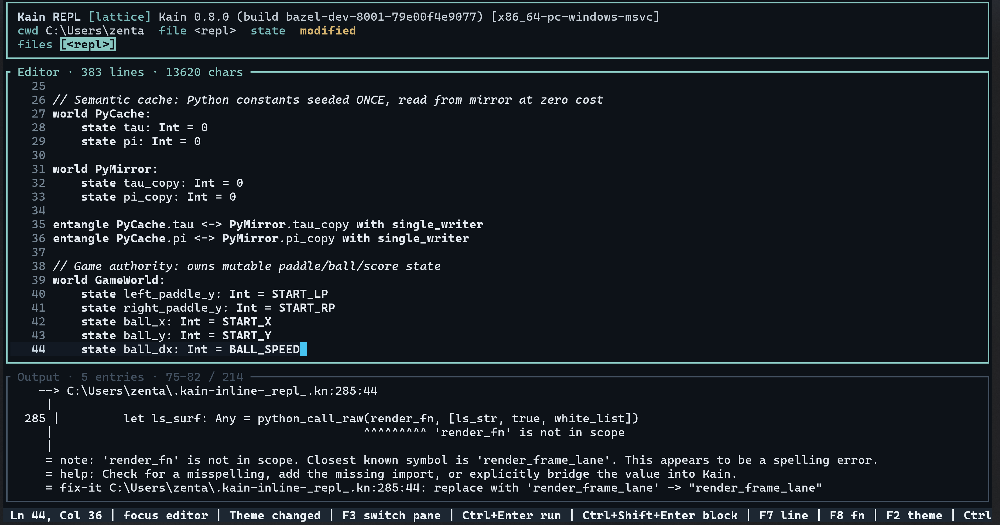

## Why Kain? 

**Safety without the therapy.** Explicit ownership: `collapse`, `observe`, `decay`. No borrow checker. No lifetime annotations. No `Rc<RefCell<Arc<Mutex<Box<dyn>>>>>>`. You say what you mean, the compiler proves you aren't wrong.

**One language, all of it.** Python syntax. GPU shaders in the same file as host code. React-style UI compiled to native. `include C` headers like you're writing C. `import python as py` like you're writing Python. One file, 18 targets.

**The compiler owns the glue.** State, mutation tracking, dispatch, timing, coupling, layout, handoff -- 15 constructs the compiler manages so you stop writing boilerplate.

## What You Get

| You love... | Kain gives you... |
|---|---|
| Python | The syntax. Significant whitespace, colons, zero ceremony and native py import. |
| Rust | Safety. Explicit ownership (`collapse`/`observe`/`decay`). No borrow checker. |
| Erlang | Actors. `spawn`, `send`, `ask`. Supervision trees. Mailbox backpressure. |
| Koka / Eff | Effects lattice. `Pure`, `IO`, `Async`, `GPU`, `Reactive`, `Unsafe`. |
| Lisp | Hygienic macros. Code as data. DSL-friendly surface. |
| React | JSX components. Typed props, local state, methods. Compiled to native. |
| Slang / Vulkan / CUDA | GPU shaders unified with host code. One file emits SPIR-V, PTX, HLSL, WGSL. |
| Zig | `comptime` blocks. `build.kn` as the project authority. No Makefile, no CMake. |
| SQLite | Amalgamation. `kain amalgamate` packs everything into one portable capsule. |
| F* / Dafny | Formal verification. 500+ Z3 proof packs across 16 directories. 6,000+ proof artifacts. 380+ SMT-LIB2 files. 10,000+ CBMC assertions. Proofs ship with the compiler. |
| Jupyter / Neovim | The `kain repl` TUI. A fully integrated terminal IDE built in. Multi-pane editor, live evaluation diagnostics, mouse support, file chips, and block-level execution (F6/F7/F8). |
| (Novel) | Compiler-owned semantics. 15 constructs that don't exist anywhere else: `world`, `patch`, `law`, `converge`, `orchestrate`, `pulse`, `resonate`, `axiom`, `shatter`, `teleport`, and more. 111 keywords total. |


## Quick Start

```
kain check file.kn                          # typecheck
kain run file.kn --target llvm              # compile + run as native .exe
kain run dev file.kn                        # watch mode
kain amalgamate src/ -o out.kn              # pack into portable capsule
kain gpu-artifacts shaders.kn --target all  # SPIR-V + PTX + HLSL + WGSL
kain repl                                   # launches TUI IDE: multi-pane editor & live diagnostics, ctrl+enter to compile to LLVM when working on code within REPL 
kain build file.kn --target llvm            # Build executable
kain build file.kn --emit sharedlib         # → .dll / .so / .dylib
kain build file.kn --emit staticlib         # → .lib / .a
kain build file.kn --emit object            # → .obj / .o

```

---

## Repo

| Directory | What |
|---|---|
| `blades/` | 60+ full projects and applications. Including **MarkScript**: a new language built with Kain that turns markdown into a into a JIT-compiled language. Also other examples such as a portable 3D engine, Python interop bridges, a semantic search engine, filesystem tools, weird experimental test and a DAW (still WIP)
| `benchmark/` | Three generations of benchmarks (v1, v2, v3). Hundreds of cases. Kain vs C++ vs Rust vs Zig vs Go vs Erlang vs Markcript vs JS vs Python. |
| `stdlib/` | 65+ modules. 3,500+ public symbols. Everything from `std::gpu` to `std::actor` to `std::json` to `std::machine` (inline asm, fences, VM ops, CPUID). |
| `runtime/native/` | The C11 execution substrate. Arena/buddy allocators. Actor scheduler with work-stealing. GPU dispatch. Ownership state machine. Crash forensics. |
| `crates/` | The Rust bootstrap compiler. 67 crates. Parser, typechecker, LLVM codegen, SPIR-V/PTX/HLSL/WGSL backends, WASM emitter, LSP service. |
| `smoketest/` | Every feature interacting together in one workspace. Not isolated snippets. Proof that the layers compose. |
| `docs/` | Language reference. Rule book. "Kain By Example" (every feature, one compilable snippet). |
