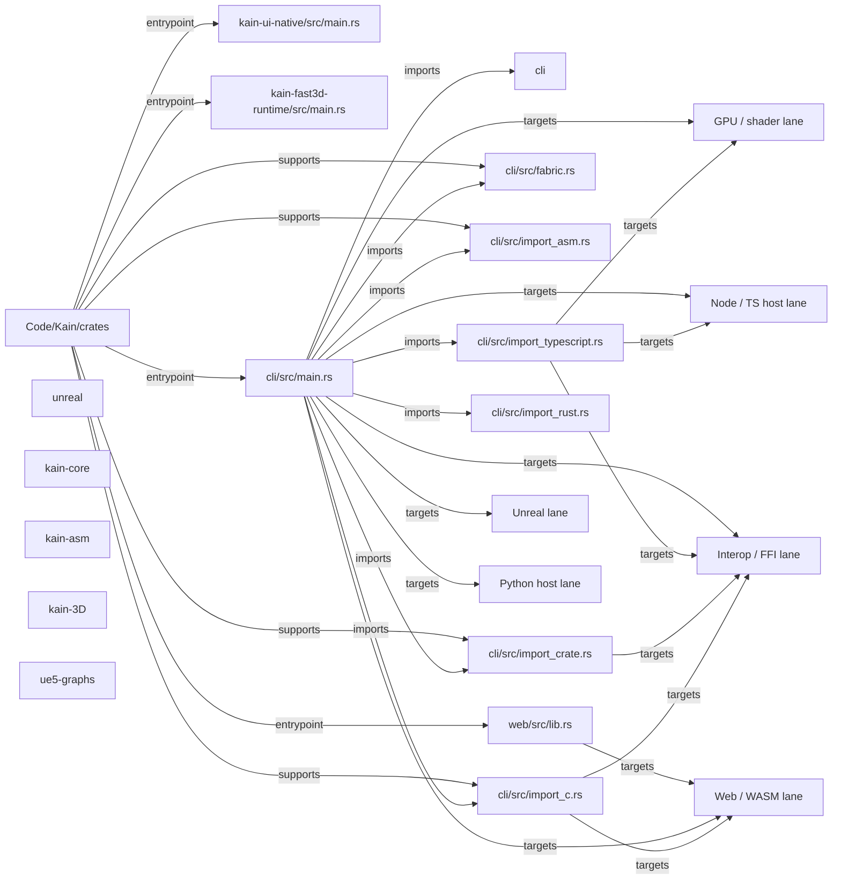

# Code/Kain/crates Flow Map

- Directory: `M:\Code\Kain\crates`
- Generated (UTC): `2026-03-28T20:00:22.324002+00:00`
- Languages: `JSON, JavaScript, Kain, Markdown, Rust, TOML, TypeScript`
- Entry files: `kain-ui-native/src/main.rs, kain-fast3d-runtime/src/main.rs, cli/src/main.rs, web/src/lib.rs`
- Manifests: `cargo, cargo, cargo, cargo, cargo, cargo, cargo, cargo, cargo, cargo, cargo, cargo`
- Additional manifests omitted from markdown: `32`

## Manifest Summary
- `browser/Cargo.toml`: cargo, deps: 4
- `cli/Cargo.toml`: cargo, deps: 39
- `gpu/Cargo.toml`: cargo, deps: 4
- `kain-3D/Cargo.toml`: cargo, deps: 7
- `kain-asm/Cargo.toml`: cargo, deps: 12
- `kain-build/Cargo.toml`: cargo, deps: 1
- `kain-c-ffi/Cargo.toml`: cargo, deps: 12
- `kain-core/Cargo.toml`: cargo, deps: 13
- `kain-crate-ffi/Cargo.toml`: cargo, deps: 10
- `kain-driver/Cargo.toml`: cargo, deps: 16
- `kain-fast3d-runtime/Cargo.toml`: cargo, deps: 8
- `kain-gpu-runtime/Cargo.toml`: cargo, deps: 6

## Edge Legend
- `entrypoint`: root directory to a main entry file or manifest.
- `supports`: root or file contributes to a lane or helper surface.
- `imports`: file-to-file or file-to-subdir reference discovered from source text.
- `targets`: file participates in a platform lane such as Tauri, Unreal, GPU, or Python.
- `emits sidecar`: file materializes a named artifact or sidecar bundle.
