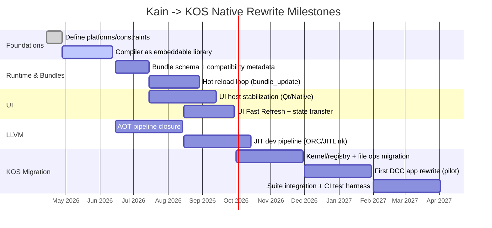

# Deep Research: Evolving Kain to Natively Rewrite KOS with React-like UI, Hot Reloading, and an Owned LLVM C Runtime

## Executive summary

Kain (ephemara/kain) is already architected *toward* the destination you describe: it contains an LLVM codegen lane (via an LLVM wrapper), a substantial native C runtime with reference counting and a stable ABI surface, a first-class “bundle” concept with compatibility metadata and migration hooks for hot reload, and a semantic UI system designed around retained trees and patch streams rather than “rebuild everything” rendering. Evidence of this direction shows up across the workspace layout (multi-crate Rust toolchain + native runtime directory tree) fileciteturn5file0, the CLI’s watch-mode and multi-target compilation model fileciteturn6file0, the native runtime ABI and service-table docs fileciteturn55file0turn56file0turn57file0, the hot-reload compatibility ABI (install/update/uninstall + snapshot/restore + migration hook) fileciteturn67file0turn70file0turn71file0, and the UI runtime’s explicit hot-reload state transfer logic (focus/selection/docking/overlays/signal/session preservation) fileciteturn72file0turn77file0.

KOS (ephemara/kos), by contrast, is presently a multi-app DCC suite built as a **Tauri v2 desktop app with a React+TypeScript frontend and a Rust backend with wgpu compute**, plus an optional Bevy viewport—explicitly documented in its production-readiness spec fileciteturn83file0. That spec also highlights systemic gaps that map cleanly onto “rewrite drivers” for a Kain-native architecture: inconsistent shell/top-bar behavior, data-driven architecture violations, broken export flows in multiple apps, and the need for suite-wide integration testing and hot reloading of configuration fileciteturn83file0. The repo itself is explicitly organized as a multi-module workspace with both web and native components fileciteturn10file0turn11file0turn9file0.

The main “missing pieces” are not conceptual—they are *integration hardening and end-to-end closure*: (a) tightening Kain’s LLVM lane into an “owned” end-to-end pipeline (IR → object/JIT → link → runtime) with minimal external glue, (b) turning the hot-reload ABI into a practical developer loop for *both code and UI state* (module boundaries, stable identities, migration auditing), (c) finishing a stable cross-platform native UI host/renderer stack (today, the non-egui native host path is explicitly constrained largely to a Qt-backed route) fileciteturn75file0, and (d) aligning the 3D engine lane with KOS’s DCC workflows (SVT painting, sculpting, export pipelines, and performance budgets) fileciteturn83file0turn82file0.

Where external “primary” guidance matters most is LLVM embedding choices (ORC JIT + JITLink vs pure AOT), and the “React-like” DX expectations (reconciliation semantics, key stability, state-preserving hot refresh). LLVM’s ORC/JITLink documentation is the most relevant north star for the JIT side citeturn0search8turn0search10turn0search2, while React’s reconciliation/key heuristics (and React-style fast refresh behavior) provide a concrete behavioral spec to emulate citeturn2search0turn2search4turn1search1. For hot reload beyond UI, dynamic software updating (DSU) literature helps frame correctness constraints around type/layout changes and state transfer—especially if you want stateful live updates beyond “reload and lose state” citeturn0search6turn0search12.

Unspecified assumptions you did **not** define (and which materially affect design choices) include target platforms (Windows-only vs Win/macOS/Linux), distribution/packaging expectations, acceptable compiler toolchain dependencies (system LLVM vs bundled), performance targets (latency vs throughput), safety model (sandboxing / untrusted plugins), and team size/bandwidth.

## Repository inventory

### kain current state

**Top-level structure and intent.** kain is a Rust workspace that also contains a native runtime and multiple “lanes” (UI, GPU, 3D, Unreal integration, etc.). The root `Cargo.toml` defines a large workspace and pins an LLVM-facing toolchain via **inkwell** with `llvm21-1` features enabled (notably “prefer-dynamic”), indicating the LLVM lane is already a first-class build target in the repo fileciteturn5file0. The repository’s own repomap documents the macro layout—`crates/`, `runtime/`, `apps/`, `docs/`, `src/`—as the main organizing axes fileciteturn7file0.

**Crates and modules.** The crate-level repomap is explicit about the breadth: `kain-core` (front-end + runtime/interpreter and UI lowering helpers), `kain-sys-codegen` lanes (including LLVM codegen), GPU/3D crates, and native UI hosting crates, among others fileciteturn9file0turn77file0turn82file0turn75file0. Two crates are especially load-bearing for your goal:

- `kain-core` already contains a JSX-capable UI evaluation/lowering pipeline that turns authored components into a semantic UI tree and emits “compiler-owned contracts” into the runtime bundle state fileciteturn77file0.
- `kain-ui` is a semantic UI runtime model with retained nodes and patch streams, and *built-in hot reload transfer machinery* for preserving runtime state across reloads fileciteturn72file0.

**Runtime (native C) and ABI surfaces.** The native runtime is not superficial: it defines a stable helper ABI and a “service table” style interface for runtime services. The baseline runtime header defines an `RcHeader` with `ref_count`, `weak_count`, and a `destructor` pointer—clear evidence of an owned reference-counted heap object model fileciteturn65file0. The native runtime also defines a canonical hot-reload/compatibility ABI with bundle installation, activation, update (with migration hook), snapshot/restore, and uninstall functions fileciteturn67file0turn71file0. Conformance tests exist and compile/execute C tests validating compatibility decisions and lifecycle semantics fileciteturn69file0turn70file0turn71file0.

**UI runtime closure in C.** kain includes native headers for a compiled UI bundle format and a UI runtime state machine capable of loading bundles, validating them, and routing input/focus/edit events—suggesting the C runtime can host UI without a JS/DOM middle layer fileciteturn80file0turn79file0.

**Build system and developer loop.** The CLI supports watch mode and emits AST/typed IR; it also supports building and running, and a “native UI” build lane fileciteturn6file0turn12file0turn13file0turn14file0. The quickstart describes `kain build` and `kain run`, as well as “native-ui” build workflows fileciteturn8file0.

**Testing and CI.** Internal Rust unit tests exist (e.g., within `kain-ui` and `kain-core`), and the runtime has C conformance tests with a custom runner fileciteturn72file0turn77file0turn69file0. A notable gap is *repository-level CI visibility*: a search suggests no clear root `.github/workflows` for kain itself (aside from a vendored workflow inside an Unreal modding subtree), implying CI standardization is either absent or handled elsewhere fileciteturn24file0.

**Runtime completion tracking.** A native runtime completion tracker exists with a dated “reality update” (March 18, 2026) claiming many phases are materially complete and identifying partial phases remaining—useful as an internal roadmap anchor fileciteturn28file0.

### KOS current state

**Architecture baseline.** KOS is documented as a DCC suite shipped as a **Tauri v2 desktop app** with a **React+TypeScript frontend** and **Rust backend** doing GPU compute via wgpu, with an optional Bevy viewport for native 3D rendering fileciteturn83file0. This is highly aligned with your stated rewrite goal: remove the JS/IPC middle layers and let Kain own the native runtime loop.

**Repo organization and modules.** KOS’s README and directory/architecture docs describe it as a workspace with multiple apps/modules (including a web app under `apps/web`) and an extensive Rust crate suite fileciteturn10file0turn11file0turn9file0. The root `Cargo.toml` frames KOS as a multi-crate workspace with many members, consistent with a modular kernel/tools architecture fileciteturn11file0.

**Existing Kain integration in KOS.** KOS already contains a `k-os-kain` crate that shells out to the `kain` CLI, compiling Kain sources into artifacts via external invocation; this is a present-day “middleman” boundary you likely want to delete by embedding the compiler/runtime directly fileciteturn39file0.

**Quality, UX, and integration gaps (driver for rewrite).** The production readiness spec calls out broken export flows in several apps, AppShell flickering during panel resize, inconsistent top bar implementations, missing cross-app integration wiring, and a need for a suite-wide integration test harness fileciteturn83file0. It also explicitly demands **hot reload for JSON configuration files** during development, reinforcing that a proper hot-reload mechanism is central to the product vision fileciteturn83file0.

**Testing and CI.** The production readiness spec sets expectations for integration tests across frontend/backend/GPU interactions and time-budget constraints (e.g., “all integration tests under 60 seconds”) fileciteturn83file0. As with kain, there is no obvious GitHub Actions footprint visible from searches, suggesting CI might be incomplete or externalized.

## Gaps to full “owned native LLVM C runtime” and no-middleman execution

### What you effectively mean by “owning” the runtime

Based on kain’s current shape, “owning the runtime” is already partially true: the repo has a concrete native runtime in C with memory management primitives, concurrency hooks, a UI runtime, and a hot reload ABI surface fileciteturn65file0turn80file0turn67file0. The remaining gaps are about **ownership completeness** and **removal of external orchestration**.

A practical definition of “owned runtime” for your rewrite (as implied by KOS’s current Tauri+React+Rust split fileciteturn83file0) would include:

- A single native event loop that owns input, UI composition, rendering, IO, and scheduling—without JS/IPC boundaries.
- A stable ABI boundary for dynamically loaded code (plugins/bundles) that supports hot updating and state migration.
- A build+link pipeline that can produce shippable artifacts (exe/app bundle) and dev artifacts (hot-loadable bundles) from Kain sources with minimal external glue.

### Concrete gaps visible from current implementations

**Cross-platform platform layer closure.** The runtime base header contains OS-conditional code for Windows and POSIX-like platforms fileciteturn65file0, but kain’s UI+viewport native runtime references Win32/OpenGL surfaces (`kain_runtime_win32.h` and Win32 GL surface usage) in the compiled UI overlay path fileciteturn80file0. If your target includes macOS/Linux with Metal/Vulkan, you’ll need explicit platform backends (windowing, input, GPU surfaces, filesystem semantics) and a stable abstraction layer.

**Cycle management in RC heap.** The runtime’s `RcHeader` model indicates ref counting + weak refs fileciteturn65file0. For a large interactive DCC suite with graphs, UI trees, scene graphs, and resource caches, cycles are common. You’ll need a strategy: ban cycles by design, provide explicit “arena lifetimes,” or implement a cycle collector / tracing GC overlay for selected object graphs.

**End-to-end LLVM lane ownership.** The toolchain uses inkwell with LLVM 21 features fileciteturn5file0, but “no middleman” implies you should be able to go from Kain → machine code (JIT or AOT) → run in the C runtime without requiring a separate host language to orchestrate meaning (e.g., not “compile to Rust then cargo build” for the real thing). The architecture *already anticipates* native lanes (`llvm`, `cpp`, `rust`) fileciteturn15file0; the gap is making LLVM the definitive path for shipping and debugging, not just one of several targets.

**Embedding instead of shelling-out.** KOS currently shells out to the `kain` CLI to compile Kain sources fileciteturn39file0. To eliminate the middleman, you want (a) `kain-core` + codegen as a library API, and (b) a runtime loader that can load compiled bundles directly. kain already has a “bundle compatibility” ABI in C fileciteturn67file0; what’s left is wiring the compiler output format to that ABI with strong versioning and tool support.

**UI host generality.** `kain-ui-native` is candid that the default non-egui native host routing “only supports the Qt-backed path right now” fileciteturn75file0. If KOS rewrite aims at a UE5/VScode-like dockable shell with high-performance viewports, you’ll likely need either (1) to fully commit to Qt/QtQuick as the shell host or (2) to complete a custom host backend (or wgpu+skia+custom windowing) under the `UiHostBackendKind::Native` story already present in `kain-ui` fileciteturn72file0.

## LLVM integration and native codegen design options

### Architectural choices: JIT, AOT, or hybrid

LLVM gives you two dominant paths:

- **AOT (ahead-of-time):** compile to object files and link into executables/shared libraries.
- **JIT (just-in-time):** compile and link in-memory, often enabling rapid iteration and fine-grained hot updates.
- **Hybrid:** JIT in dev, AOT in release; or AOT for “base engine” + JIT for scripts/plugins.

LLVM’s modern JIT story is **ORC (ORCv2)**, which is explicitly designed as a modular “JIT-as-linker” system and supports linking relocatable objects into a process at runtime citeturn0search8turn0search2. ORC’s JIT linking is commonly handled via **JITLink** and ORC’s ObjectLinkingLayer, aiming to support object-format features like exception handling and TLS citeturn0search10turn0search1.

#### Comparison table: JIT vs AOT for Kain/KOS rewrite

| Dimension | ORC JIT (dev-first) | AOT (ship-first) | Hybrid (recommended default) |
|---|---|---|
| Iteration speed | Extremely strong; compile only what changed; can model module-level updates with ORC’s JITDylibs citeturn0search8turn0search2 | Slower; requires relink/signing steps | Strong in dev; stable in release |
| Hot reload semantics | Natural fit: load new symbols, rebind function tables, keep state in runtime-owned heaps; ORC supports eager/lazy compilation and modular linking citeturn0search8turn0search2 | Hot reload requires shared-library swapping or embedded “bundle” loader | Use ORC-like module model in dev, compile bundles to shared libs in staging, AOT in release |
| Determinism/reproducibility | Harder; depends on runtime environment and JIT caches | Best; artifact is stable and testable | Release artifacts deterministic, dev flexible |
| Security/sandboxing | Riskier in-process; safer with remote/out-of-process JIT (LLVM tutorial covers “Remote-JITing” concepts) citeturn0search16 | More controllable; code signing possible | Use out-of-process compilation, in-process load under strict ABI |
| Debugging | Complex but feasible with JIT debug info; needs solid tooling | Familiar; DWARF/PDB flows | Best overall, but requires dual-path maintenance |
| Performance | Can be excellent; but startup and warmup vary | Predictable; better startup | Mixed; tune per mode |

### Embedding LLVM: APIs and internal layering

Because kain is a Rust toolchain workspace and already depends on inkwell with LLVM 21 fileciteturn5file0, you have two pragmatic embedding strategies:

**Strategy A: “Rust front-end + LLVM via inkwell” (incremental hardening).**  
Keep the compiler pipeline in Rust (kain-core + typed IR + backend), and treat LLVM as the codegen and optimization engine. You then standardize the output as either:
- AOT: object file + link with your C runtime into exe/sharedlib.
- JIT: ORC used from C++ or Rust bindings; Rust ORC bindings are less mature than C++ APIs, but you can bridge.

**Strategy B: “C ABI boundary around the compiler too.”**  
If “no middleman” also implies that the runtime can invoke compilation services (for live coding) without depending on Rust crates being directly embedded, you can wrap compiler entry points into a stable C API (like `kain_compile_bundle(...)`) and ship a compiler service as a dynamic library or external process.

From an engineering-risk standpoint, Strategy A is lower friction because kain is already organized as Rust crates and a CLI fileciteturn6file0turn9file0; Strategy B is a later hardening step if you truly want the runtime to be “language-implementation agnostic.”

### A “bundle-as-module” model aligned with ORC and Kain’s ABI

kain already has a native runtime **bundle lifecycle and compatibility ABI** in C, including `kain_bundle_install`, `kain_bundle_update`, and snapshot/restore functions fileciteturn67file0turn71file0. ORC’s model is similarly linker-like: it organizes code into *JITDylibs* and resolves symbols across them citeturn0search8turn0search2.

A strong convergence plan is therefore:

- Define a Kain **Bundle** as:
  - Code payload (AOT sharedlib OR ORC-loaded object).
  - Data payload (UI bundle JSON, shader bundles, schemas, asset registries).
  - Compatibility metadata (ABI version, required services mask, migration requirement) fileciteturn67file0.
- Define runtime-owned **service tables** and stable import points (C ABI functions) fileciteturn56file0turn54file0.
- Map Kain module namespaces to ORC JITDylibs in dev, and to OS dynamic libraries in release.

## Memory, ABI, and type mapping between Kain and C/LLVM

### Runtime memory model: reference counting as the default heap contract

The native runtime’s `RcHeader` provides the core: refcount + weakcount + type-tag + destructor fileciteturn65file0. This implies a canonical layout:

```
[ RcHeader | object payload ... ]
```

With this model, “state migration” during hot reload becomes amenable to:
- Copy/transform payloads based on `type_tag`.
- Retain/release rules enforced consistently across old/new module boundaries.
- Weak references that can be invalidated across unload.

**Key risk:** cycles. For UI + scene graphs + caches, cycles are common. Without a plan, leaks are inevitable. In practice, you’ll want at least one of:
- A “no cycles” policy for RC-owned graphs (enforced by tooling).
- Arena-based ownership for cyclic domains (scene graph, UI tree).
- A cycle collector pass integrated into the runtime for selected object families.

### Low-level memory semantics and “unsafe” operations

kain’s docs explicitly discuss low-level memory, pointer provenance, and semantics for unsafe constructs fileciteturn47file0. This is essential for LLVM codegen correctness, because aliasing/provenance assumptions can enable miscompilations if the language’s rules are not explicit.

A compiler-facing checklist for correctness:

- Define which operations preserve provenance.
- Define the aliasing model for `mem_load`/`mem_store` (if they exist as IR-level ops).
- Define how slice/array views translate into pointer+len pairs.
- Define when the compiler may assume non-aliasing (e.g., `&mut`-like semantics) vs must assume aliasing (C-like pointers).

### Practical type mapping table for initial LLVM backend closure

This table is a recommended “minimum viable ABI contract” if you plan to interop heavily with C and your owned runtime.

| Kain concept | Canonical runtime representation | LLVM IR type | C ABI surface type |
|---|---|---|---|
| `Bool` | 1 byte or i1 logical; decide ABI (recommend `i8` in memory, `i1` in SSA) | `i1` (SSA), `i8` (memory) | `uint8_t` |
| `Int` (default) | 64-bit signed | `i64` | `int64_t` |
| `Float` (default) | 64-bit IEEE | `double` | `double` |
| String | RC object with header + `{ptr,len}` or `{ptr, len, cap}` | `{ptr, i64}` or `{ptr,i64,i64}` | struct + helpers |
| Dynamic array | `KainArray { long long* data; long long len; long long cap; }` exists already fileciteturn65file0 | `{ptr, i64, i64}` | `KainArray` |
| Map | `KainMap` exists with entries/cap/count fileciteturn65file0 | struct | `KainMap` |
| Heap object | `RcHeader + payload` fileciteturn65file0 | `ptr` | `void*` / typed pointer |
| Actor message | `MessageNode` + queue exists fileciteturn65file0 | struct/ptr | `MessageNode*` |

The key is to keep *ABI-stable* representations for the pieces that cross module boundaries (FFI, runtime services, hot reload), while allowing internal compiler IR to evolve.

### Runtime services inventory against your goals

kain’s native runtime and docs indicate the runtime is meant to provide a service-table model and helper ABI functions fileciteturn56file0turn54file0, plus explicit bundle compatibility and migration hooks for hot reload fileciteturn67file0turn71file0. The UI runtime in C already includes validation, component state tracking, focus, editability, and event routing fileciteturn79file0turn80file0.

For a full KOS rewrite, the runtime also needs first-class support for:

- GPU device/queue abstraction and shader pipelines (to replace today’s split wgpu/Bevy/JS approaches in KOS) fileciteturn83file0turn82file0.
- Filesystem/project storage abstraction (KOS has explicit project storage requirements) fileciteturn83file0.
- Sandboxing/plugin safety model if bundles can be third-party.

## Hot reloading and React-like UI integration

### React-like semantics: what to emulate, what to intentionally diverge

React reconciliation is fundamentally “diff old tree vs new tree, apply minimal mutations,” with **keys** as the primary identity mechanism for preserving component instances/state across list changes citeturn2search4turn2search0. The Fiber architecture adds scheduling concepts: incremental work, pausing/aborting, and prioritizing updates, largely to improve animation/layout responsiveness citeturn2search0.

kain already has two complementary UI layers:

1. A **runtime VNode model** produced by evaluating JSX/components, with an explicit (currently conservative) `reconcile` hook as a placeholder for diff-based rendering fileciteturn77file0.
2. A **semantic retained UI tree** (`UiTree`) plus patch stream (`UiPatch`) and runtime systems (signals, resources, focus graph, surfaces, overlay stack, docking layout, command registry), explicitly designed to be backend-neutral and to preserve stable identity across reload fileciteturn72file0turn77file0.

This is best understood as: **Kain UI is already “React-like” in authoring ergonomics (JSX/components/props/state), but deliberately retained-mode in runtime representation**—which is often a better fit for a high-performance native DCC shell.

### Practical hot reload: align runtime ABI + UI state transfer + “Fast Refresh”-style heuristics

React-style “fast refresh” is not just “reload code”; it is “reload code and preserve component state when safe.” React Native’s Fast Refresh documents clear heuristics: if a module only exports components, update in place and rerender; if a module exports non-component values (or is imported outside the React tree), fall back to broader reload; it also allows a directive to force remount/reset state citeturn1search1.

kain already has the lower-level building blocks to implement an equivalent (arguably stronger) model:

- **Bundle hot reload ABI** supports update with migration hooks and snapshot/restore fileciteturn67file0turn71file0.
- **UI hot reload transfer** can preserve focus, selection, docking, overlays, motion policy, animation state, signal values, and session state—and reports identity/linking and invalidation information fileciteturn72file0.
- **Signals** can be given stable IDs via hashing of contract keys in `kain-core`’s UI lowering, enabling state continuity across rebuilds even when tree shape changes fileciteturn77file0.

#### Hot reload techniques comparison

| Technique | What changes | State preservation | Complexity | Best use |
|---|---|---|---|---|
| Full restart | Everything | None | Low | Early bring-up, crash recovery |
| Module-level reload (bundles) | Replace code module/bundle | Requires explicit state boundary + migration hook | Medium | Kain runtime bundle model fileciteturn67file0turn71file0 |
| UI-only fast refresh | Update UI component code | Preserve UI state when identities stable | Medium | UI iteration; Kain already has transfer logic fileciteturn72file0 |
| DSU / live patching | Patch code + data layouts | Can preserve almost all state when proven safe; hardest correctness | High | Long-running sessions, mission-critical uptime; DSU research highlights type-safety + state transfer constraints citeturn0search6turn0search12 |

### Recommended “Kain Dev Loop” architecture

A practical native dev loop for the KOS rewrite can be structured around **three layers of reload**, ordered by safety:

- **UI refresh (most frequent):** Rebuild UI bundle, apply `ui_transfer_hot_reload_state`, then emit patches to the host. This should be sub-second and largely state-preserving fileciteturn72file0turn77file0.
- **Logic bundle hot reload (frequent):** Recompile a Kain module into a new bundle, call `kain_bundle_update` with a migration hook. Use snapshot/restore boundaries for actor/task state fileciteturn67file0turn71file0.
- **Engine/runtime reload (rare):** Restart process (or swap core shared lib) when ABI breaks.

#### Pseudocode sketch: bundle-level hot swap with migration

```c
// Runtime-side hot update (conceptual)
KainBundleHandle* handle = kain_bundle_install(path_v1, &meta_v1, &diag);
kain_bundle_activate(handle, &diag);

void* snapshot = kain_bundle_snapshot_state(handle, &diag);

// compile new bundle to path_v2 (AOT or JIT-produced)
int rc = kain_bundle_update(handle, path_v2, &meta_v2, migration_hook, &diag);

if (rc != 0) {
  // rollback or keep old bundle active
  kain_bundle_restore_state(handle, snapshot, &diag);
}
kain_bundle_free_state_snapshot(snapshot);
```

This directly mirrors the runtime ABI surface already defined and tested in conformance tests fileciteturn67file0turn71file0turn69file0.

### UI backend strategy: virtual DOM vs retained semantic tree vs hybrid

kain’s UI crate explicitly positions itself as retained semantic meaning + patch streams “instead of a virtual DOM-first execution model” fileciteturn72file0, while `kain-core` contains both VNode and semantic lowering fileciteturn77file0. For a DCC suite UI, the recommended direction is:

- **Keep semantic retained tree as the canonical runtime contract** (better for docking, GPU viewports, accessibility trees, command registries).
- **Implement a React-like reconciler at the authoring boundary** (JSX/components → stable semantic tree), using React’s “stable keys preserve identity” rule as the developer-facing mental model citeturn2search4turn2search0.
- Use “fast refresh” heuristics modeled after React Native’s Fast Refresh: preserve state by default, allow opt-out/reset directives citeturn1search1.

#### UI binding strategy comparison table

| Strategy | Rendering model | Pros | Cons | Fit for KOS rewrite |
|---|---|---|---|---|
| Virtual DOM + diff (React-like) | Recompute tree, diff, apply ops | Familiar mental model; good for web-like UI citeturn2search4turn2search0 | Can be wasteful for complex native shells; needs careful scheduling | Good authoring surface; not ideal as core runtime |
| Retained semantic tree + patches (Kain UI) | Maintain canonical tree, emit patch stream | Stable identities; backend-neutral; ideal for docking/workspaces and tooling fileciteturn72file0 | Requires strong compiler lowering and tooling | Best core runtime contract |
| Immediate mode UI (ImGui-style) | Reissue draw calls every frame | Very fast to prototype tools | Harder persistence/state; accessibility/docking semantics are harder | Useful for devtools surfaces only (which Kain already models) fileciteturn72file0 |

## 3D engine considerations for a KOS rewrite

### What KOS needs (by its own spec)

KOS’s production readiness document describes a suite where the Rust backend + GPU engine are shared across apps, with heavy workflows: high-poly sculpting, SVT painting (16K+ textures), import/export, undo/redo, and real-time interaction with sub-16ms behavior under rapid input fileciteturn83file0. It also highlights data-driven architecture as a core principle and notes violations where hardcoded settings block scalability fileciteturn83file0.

A Kain-native rewrite needs to preserve and improve these qualities:

- Data-driven tool registries (brushes, view modes, export formats).
- Unified kernel/asset registry with cross-app identity.
- GPU compute + rendering integrated without IPC glue.

### What kain already has in its 3D lane

kain includes a `kain-3D` crate that clearly covers authoring, interaction, renderer, scene representation, shader bundles, and a wgpu renderer fileciteturn82file0. This strongly suggests the intended “KOS replacement” path is:

- Use Kain for authoring “apps” and tools.
- Use `kain-3D` as the base viewport/scene/rendering substrate.
- Integrate with the Kain UI surfaces model (`Viewport3D`, shader surfaces, layered GPU composition) already embedded in the UI runtime systems fileciteturn72file0.

### Recommended engine architecture direction: hybrid scene graph + ECS, data-oriented pipelines

For DCC tools, a pure ECS is often insufficient for authoring semantics (hierarchical transforms, parent-child relationships, layering), but ECS excels at simulation/update scheduling and data-oriented performance. “Entity systems” are widely motivated by modularity and fast iteration and have historic relevance to “changing logic after launch,” which maps to your hot reload goals citeturn1search0. Data-oriented design thinking (popularized in performance-critical game development contexts) reinforces struct-of-arrays and cache-oriented pipelines for predictable performance citeturn1search7turn1search49.

A pragmatic model:

- **Scene graph** for authoring (hierarchy, selections, constraints).
- **ECS/SoA subsystems** for high-frequency updates (simulation, gizmos, brush sampling, GPU dispatch preparation).
- **Resource graph** for GPU assets (buffers, textures, bind groups), driven by explicit lifetime + hot-reload behavior.

### GPU bindings and shader pipeline

kain’s UI runtime systems already model GPU-backed surfaces and shader bindings (e.g., `UiSurfaceShaderBinding`, `UiSurfaceRendererPreference::Shader`, composition modes that imply shader canvas vs viewport) fileciteturn72file0. KOS’s current stack relies on wgpu compute in Rust and optional Bevy integration fileciteturn83file0; a no-middleman rewrite should move toward:

- A single GPU backend (wgpu or native Vulkan/Metal/D3D12 abstraction) with stable runtime services.
- Shader compilation pipeline integrated into the Kain build/bundle system, producing shader bundles as first-class resources.

## Developer UX, testing/CI, security and performance tradeoffs

### Developer UX: what exists and what’s missing

kain has strong primitives for developer iteration:

- CLI watch mode fileciteturn6file0.
- A clean “authoring → semantic UI tree → runtime bundle” pipeline fileciteturn77file0turn72file0.
- A formal hot reload ABI and conformance tests fileciteturn67file0turn69file0.

To make Kain *feel* like “React + hot reload” for day-to-day work, the remaining DX pieces are typically:

- Stable project scaffolding conventions (workspace layout, build graph).
- Language server / IDE integration (completion, go-to-def, diagnostics).
- Debugging: mapping runtime errors back to source spans (source maps / span tables).
- Deterministic reproduction of hot reload events and state migrations (visible audit logs for migrations + invalidations).

### Testing strategy aligned to KOS requirements

KOS explicitly demands suite-wide integration tests across UI/frontend/backend/GPU, with strong error reporting and tight time budgets fileciteturn83file0. In a Kain-native rewrite, you should port those expectations into a layered test pyramid:

- **Compiler correctness tests:** parsing, typing, codegen snapshots (IR-level tests).
- **Runtime ABI conformance tests:** already scaffolded for hot reload in C fileciteturn69file0turn70file0turn71file0; extend similarly for memory, threading, and service table.
- **UI determinism tests:** compile UI bundle, apply state transfer, assert stable identities and expected patches.
- **GPU golden tests:** shader outputs validated against CPU reference paths (KOS already expects GPU verification) fileciteturn83file0.
- **End-to-end DCC workflow tests:** import → edit → undo/redo → export, and verify artifact integrity.

### Security and stability risks

Hot reload + native code + GPU is a high-risk combination. The major risk classes:

- **ABI drift / layout mismatch:** hot-reloading code that assumes a different struct layout than existing state. Mitigate with explicit ABI versioning + migration requirements (already modeled) fileciteturn67file0.
- **State migration bugs:** DSU literature emphasizes that state transfer must be type-safe and consistent; automated tooling can help but cannot eliminate semantic bugs citeturn0search6turn0search12.
- **Memory leaks / cycles:** RC without cycle handling in a large graph-heavy app is a long-term stability threat fileciteturn65file0.
- **In-process JIT hazards:** executing newly compiled code in-process can be a sandboxing problem; ORC supports remote/out-of-process execution models in its tutorial/architecture discussions citeturn0search16turn0search8.
- **GPU device loss and driver instability:** KOS already expects resilience here fileciteturn83file0; runtime must isolate and recover GPU resources.

## Prioritized implementation roadmap

### Strategic sequencing

The most reliable path is to **first remove the KOS↔Kain “shell-out” boundary**, then harden the **bundle + hot reload + UI runtime** loop, then close the LLVM lane for dev (JIT) and release (AOT), then migrate KOS subsystems incrementally.

### Milestone plan with effort and risk

| Milestone | What you build | Effort | Main risks | Mitigations |
|---|---|---|---|---|
| Native compiler embedding | Library API for compiling Kain sources to bundles (replace KOS shell-out) fileciteturn39file0 | High | API churn across crates | Stabilize public “driver” crate; keep internal modules private |
| Bundle format hardening | Versioned bundle schema + runtime validation; compatibility metadata standardized fileciteturn67file0turn72file0 | Medium | Back-compat breaks | Strict schema versioning + compatibility classes (already modeled) fileciteturn67file0 |
| Hot reload developer loop | File watcher → rebuild → `kain_bundle_update` → migration logs; UI state transfer via `ui_transfer_hot_reload_state` fileciteturn67file0turn72file0 | High | Migration correctness | Default-safe policies; require explicit “manual migration” for risky changes fileciteturn67file0 |
| LLVM AOT lane closure | Deterministic IR + object emission + link with C runtime; shipable exe | High | Toolchain variability | Bundle LLVM or pin; validate toolchain in `kain doctor` fileciteturn8file0 |
| LLVM JIT dev lane | ORC-based loading of module bundles; symbol rebinding for hot updates citeturn0search8turn0search10 | High | Debugging + safety | Out-of-process compilation; strict API surface; optionally remote JIT citeturn0search16 |
| Native UI host maturity | Commit to Qt host or implement true “Native” backend; docking/workspace stable | Medium/High | Cross-platform divergence | Pick one primary host; others behind feature flags fileciteturn75file0turn72file0 |
| KOS feature migration | Port DCC apps, GPU engine features, export pipelines, registry system fileciteturn83file0 | High | Scope explosion | One app at a time; shared registries first |

### Mermaid roadmap flowchart

```mermaid
flowchart TD
  A[Define target platforms & constraints] --> B[Stabilize Kain compiler as embeddable library]
  B --> C[Standardize Bundle schema + compatibility metadata]
  C --> D[Hot Reload Loop: watcher -> rebuild -> bundle_update + migration]
  C --> E[UI Loop: rebuild UI bundle -> ui_transfer_hot_reload_state -> patch stream]
  C --> F[LLVM AOT Pipeline: IR -> obj -> link with C runtime]
  F --> G[Shipable Native Host App (Kain-based KOS shell)]
  D --> H[LLVM JIT Dev Pipeline (ORC/JITLink)]
  H --> G
  G --> I[Migrate KOS subsystems: kernel, asset registry, GPU engine]
  I --> J[Migrate DCC apps incrementally]
  J --> K[Suite-wide integration tests + perf budgets]
```

### Mermaid Gantt-style timeline (order, not calendar-accurate)



## Key recommendations and “next architectural moves” inside kain

### Make Kain’s UI promise “React-like” at the authoring boundary, not by copying React internals

React’s reconciliation heuristics and key stability rules are a good external behavioral spec citeturn2search4turn2search0, but kain’s retained semantic UI + patch streams is *better aligned* with a native DCC workspace shell fileciteturn72file0. The recommended plan is:

- Keep JSX/components as the authoring model (`kain-core` already does this) fileciteturn77file0.
- Ensure stable identity keys and introduce explicit “refresh reset” directives (modeled after Fast Refresh) citeturn1search1.
- Treat UI systems (docking, focus, overlays, command registry) as *runtime truth*, already preserved across reload by `ui_transfer_hot_reload_state` fileciteturn72file0.

### Use ORC/JITLink concepts to inform dev-time hot reload, but keep a stable AOT release pipeline

ORC is explicitly modular and designed for composing JIT stacks that compile LLVM IR and link relocatable objects, and JITLink aims to support object-format correctness features like TLS and runtime registration citeturn0search8turn0search10turn0search1. That makes it a strong conceptual match to Kain’s bundle lifecycle model fileciteturn67file0—but you still want AOT for shipping and reproducibility.

A strong default stance is:

- **Dev:** incremental compilation + module-level bundle hot swap (potentially JIT-linked).
- **Release:** AOT compile + link + strict ABI version pinning.

### Treat DSU literature as the correctness floor for “stateful” hot reload

If you push beyond “reload code and re-run evaluators” into “live update with preserved state,” DSU work like Ginseng and UMD’s DSU papers emphasize two non-negotiables: type/layout safety and explicit, correct state transfer functions citeturn0search6turn0search12. kain already models migration requirements and provides a migration hook in the runtime ABI fileciteturn67file0; the roadmap should explicitly include:

- Tooling to compute “migration requirement” automatically from type/ABI deltas where possible.
- A structured migration test harness (property tests + replay logs).

---

**Net assessment:** You can realistically evolve kain into a first-class, no-middleman KOS replacement by leaning into what’s already there—bundle lifecycle + C runtime ABI + semantic UI contracts + UI state transfer—and then focusing engineering effort on (1) LLVM lane closure (dev JIT + release AOT), (2) cross-platform native host backends, and (3) correctness tooling for stateful hot reload. The KOS production-readiness issues are precisely the kind of integration brittleness that a unified Kain-native runtime + data-driven registries can address, if you treat bundling/hot reload/versioning as core product infrastructure rather than a dev-only feature fileciteturn83file0turn67file0turn72file0.
