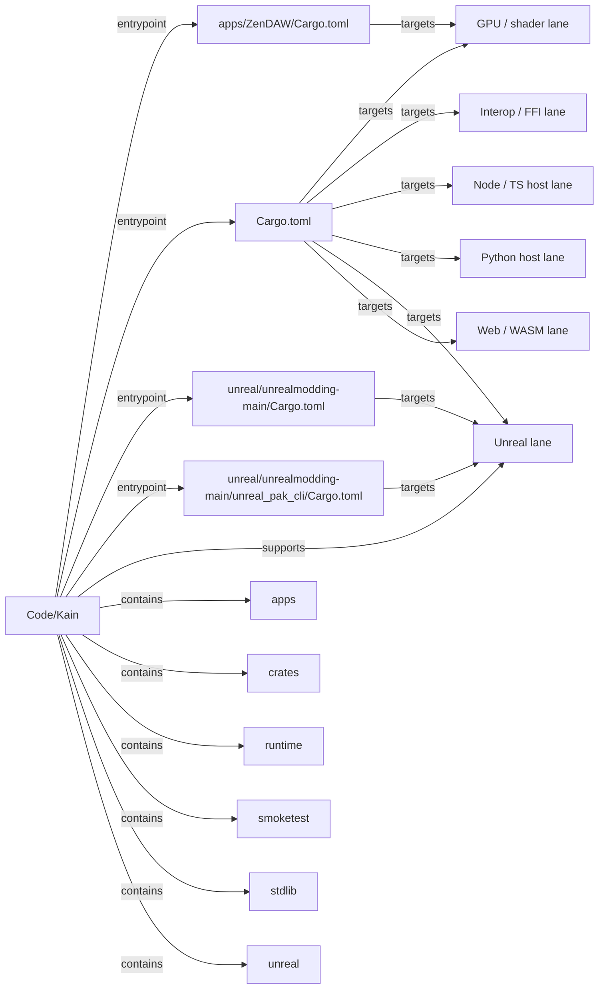

# Code/Kain Flow Map

- Directory: `M:\Code\Kain`
- Generated (UTC): `2026-03-29T16:00:08.285877+00:00`
- Languages: `JSON, Markdown, Rust, TOML`
- Entry files: `Cargo.toml, unreal/unrealmodding-main/Cargo.toml, apps/ZenDAW/Cargo.toml, unreal/unrealmodding-main/unreal_pak_cli/Cargo.toml`
- Manifests: `cargo, cargo, cargo, cargo, cargo, cargo, cargo, cargo, cargo, cargo, cargo, cargo`
- Additional manifests omitted from markdown: `53`

## Manifest Summary
- `Cargo.toml`: cargo, workspace members: 43, deps: 0
- `apps/ZenDAW/Cargo.toml`: cargo, workspace members: 8, deps: 0
- `unreal/unrealmodding-main/Cargo.toml`: cargo, workspace members: 16, deps: 0
- `apps/kade-desktop/controller/Cargo.toml`: cargo, deps: 5
- `apps/kain-fabric-dcc-suite/local_crate/Cargo.toml`: cargo, deps: 0
- `apps/kain-fabric-dcc-suite/native-app/Cargo.toml`: cargo, deps: 1
- `apps/kain-fabric-modeler/local_crate/Cargo.toml`: cargo, deps: 0
- `apps/kain-fabric-modeler/native-app/Cargo.toml`: cargo, deps: 1
- `labs/native_ui_viewport_smoke/native_ui_viewport_smoke-native-ui/Cargo.toml`: cargo, deps: 1
- `unreal/unrealmodding-main/dll_injector/Cargo.toml`: cargo, deps: 0
- `unreal/unrealmodding-main/github_helpers/Cargo.toml`: cargo, deps: 3
- `unreal/unrealmodding-main/unreal_asset/Cargo.toml`: cargo, deps: 8

## Edge Legend
- `entrypoint`: root directory to a main entry file or manifest.
- `supports`: root or file contributes to a lane or helper surface.
- `imports`: file-to-file or file-to-subdir reference discovered from source text.
- `targets`: file participates in a platform lane such as Tauri, Unreal, GPU, or Python.
- `emits sidecar`: file materializes a named artifact or sidecar bundle.
